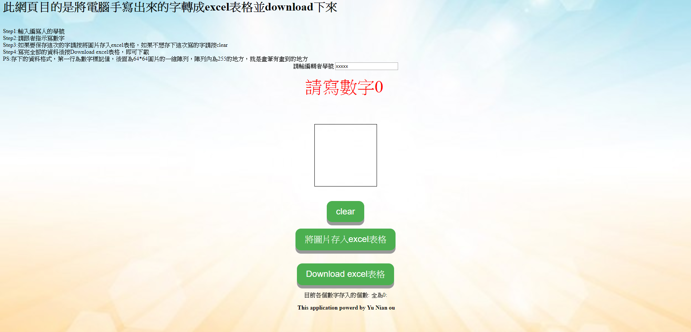
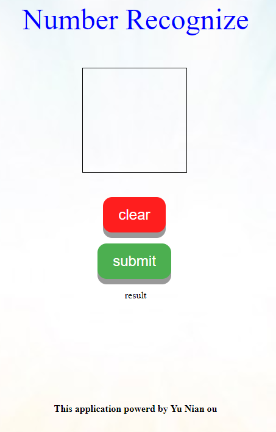
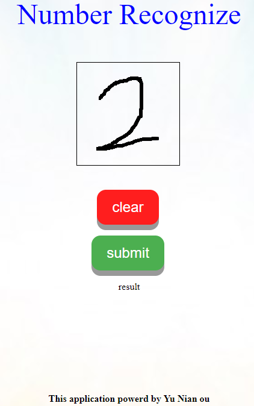
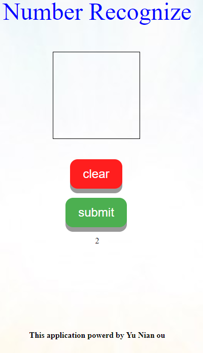
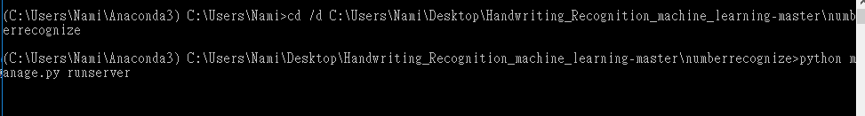
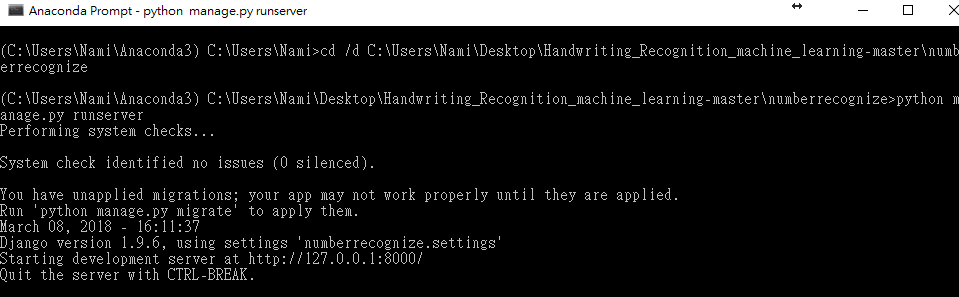

# Handwriting_Recognition_machine_learning
機器學習手寫辨識數字專案
This project is a example about number_recognizing by tensorflow and django framework. 
If you have installed tensorflow and django. 
you can use python manage.py runserver to run this project. 
The website include two pages:
1.http://127.0.0.1:8000/data_generator/

2.http://127.0.0.1:8000/index/
you can use this page to predict number,for example if I write a number two. 

 

 

 
##Installation Dependencies:

| os| gpu | IDE|  website framework|  
| -- | -- | -- | -- |
| win10 | GTX 1060 | anaconda:3.5.2|django|
 
##Installation step:
first step: install CUDA and cuDNN for installing tensorflow1.4
 
install tourtial URL:https://www.tensorflow.org/install/install_windows
 
two step: pip install -r requirements.txt
 
third step : change your cmd path to manage.py folder and run manage.py script 

 python manage.py runserver

